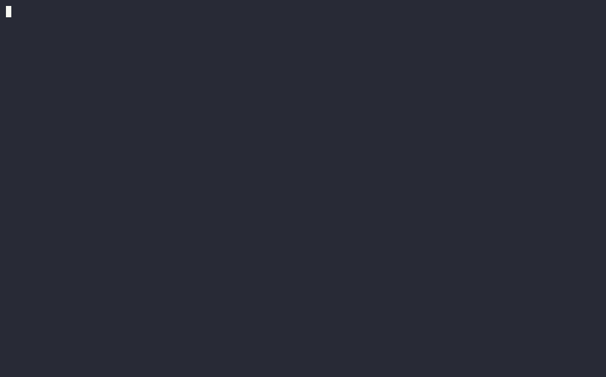

# flowtty

React for the terminal. A `react-reconciler` host over Yoga flexbox lays out
`<Box>` and `<Text>`, paints them into a cell buffer, and writes that buffer to a
backend — a full-screen TTY, an inline live region, or an in-memory surface for
tests.



> Reconciliation is React's and layout is Yoga's — both proven. flowtty adds what
> sits between them and the terminal: a cell renderer with frame diffing, the
> input layer, and the components and patterns for building an actual app —
> forms, dialogs, scrolling, a chat-style input, a test backend.

## Quick start

```bash
npm install @flowtty/react @flowtty/tty-backend react
```

```tsx
import React, { useState } from 'react';
import { render, Box, Text, useApp, useInput } from '@flowtty/react';
import { TtyBackend } from '@flowtty/tty-backend';

function Counter() {
  const { exit } = useApp();
  const [count, setCount] = useState(0);
  useInput((key) => {
    if (key.name === 'up') setCount((n) => n + 1);
    if (key.name === 'down') setCount((n) => n - 1);
    if (key.name === 'q') exit(count);
  });
  return (
    <Box flexDirection="column" border="round" borderTitle=" counter " paddingX={1} width={34}>
      <Text bold color={count < 0 ? 'red' : 'green'}>{String(count)}</Text>
      <Text dim>↑ / ↓ change it · q quits</Text>
    </Box>
  );
}

const app = await render(<Counter />, new TtyBackend());
console.log('final count:', await app.waitUntilExit());
```

Run it with `tsx`, Bun, or anything that compiles TSX; it also works as a
`bun build --compile` single-file binary. `useInput` gets every key as a plain
object, `useApp().exit(value)` quits, and `waitUntilExit()` resolves once the
terminal is back to normal — so the last line prints on the ordinary screen.

## What's inside

| | |
|---|---|
| **Layout** | flexbox via Yoga, borders with titles, padding / margin / gap, wrap, absolute positioning, `zIndex`, `overflow`, scroll viewports, a dimming backdrop — [docs/layout.md](docs/layout.md) |
| **Components** | `ScrollBox`, `ScrollList`, `TextInput`, `TextArea`, `Select`, `MultiSelect`, `Table`, `Markdown` (GFM tables, nested lists, highlighted code), `Spinner`, `Shimmer`, `ProgressBar`, `TaskList`, `Link`, `Static` — [docs/components.md](docs/components.md) |
| **Input, focus, forms** | keys with modifiers, bracketed paste as one event, the mouse wheel and buttons, drag-to-select with per-pane scopes, `FocusGroup` + `Button`, `Form` with validation (Zod-friendly) — [docs/input.md](docs/input.md) |
| **Copying out** | copy-on-select over the drawn frame, soft-wrapped paragraphs pasted as one line, `useApp().copy()`, OSC 52 with an `onCopy` fallback signal — [docs/input.md](docs/input.md#selection) |
| **The app around them** | `render` / `waitUntilExit` / `useApp().exit`, `renderToString` for one-shot output, error handling, a root abort signal, a ticker for animation, `DialogHost` with stacked dialogs, `useApp().bell()` / `.notify()` for attention from another window, `useColorScheme()` to follow the terminal's light or dark scheme — [docs/app.md](docs/app.md) |
| **Testing** | `TestBackend`: frames as strings, cells with styles, `press` / `paste` / `wheel` / `mouse`, a settable color scheme, recorded bells, notifications and clipboard writes; scripts that drive a whole app — [docs/testing.md](docs/testing.md) |
| **Extending** | [writing a component](docs/writing-a-component.md), [writing a backend](docs/writing-a-backend.md), [CONTRIBUTING](CONTRIBUTING.md), and what each release changed in the [CHANGELOG](CHANGELOG.md) |
| **Terminal specifics** | named and 24-bit color, glyph width, OSC 8 hyperlinks, desktop notifications, light and dark detection, what is not there yet — [docs/terminal.md](docs/terminal.md) |

Packages: [`@flowtty/react`](packages/react) (components, hooks, `render`),
[`@flowtty/core`](packages/core) (buffer, layout, paint, reducers, `TestBackend`),
[`@flowtty/tty-backend`](packages/tty-backend) (alt screen, keys, mouse),
[`@flowtty/inline-tty-backend`](packages/inline-tty-backend) (a live region with
an append-only log above it).

## Showcase

```bash
npm run showcase            # a self-playing tour: layout, forms, table + markdown,
                            # progress, a chat, dialogs, and a game of snake
```

It plays itself — a script types, tabs and scrolls through seven scenes — and
hands over the keys the moment you press one (`Ctrl+G` gives them back, `Ctrl+N` /
`Ctrl+P` change scene). It needs a 100×30 terminal. `--speed 2`, `--manual`,
`--loop` and `--exit` are there too.

The script is an ordinary list of steps (`type`, `press`, `paste`, `wheel`,
`waitFor`) fed through a `Backend` wrapper, so the very same script runs against
`TestBackend` in the test suite: what gets recorded is what gets tested.
`npm run showcase:record` runs it in a pseudo-terminal, saves every byte it prints
with its timestamp as `docs/showcase.cast` (an asciicast — replay it with
`asciinema play`), and renders `docs/showcase.gif` with `agg`. No browser and no
screen capture are involved.

## Status

Alpha — `1.0.0-alpha.x` on npm. APIs can still change between alphas; each
release's notes list what breaks. Runs on Node and Bun.

Not there yet: cell-accurate wide glyphs (a CJK or emoji glyph takes one grid
cell, so text after it overlaps its right half), hit-testing a mouse key against
the laid-out tree (the keys themselves carry the cell), the Kitty keyboard
protocol — see [what is deferred](docs/terminal.md#still-deferred-later-milestones).

## License

MIT
